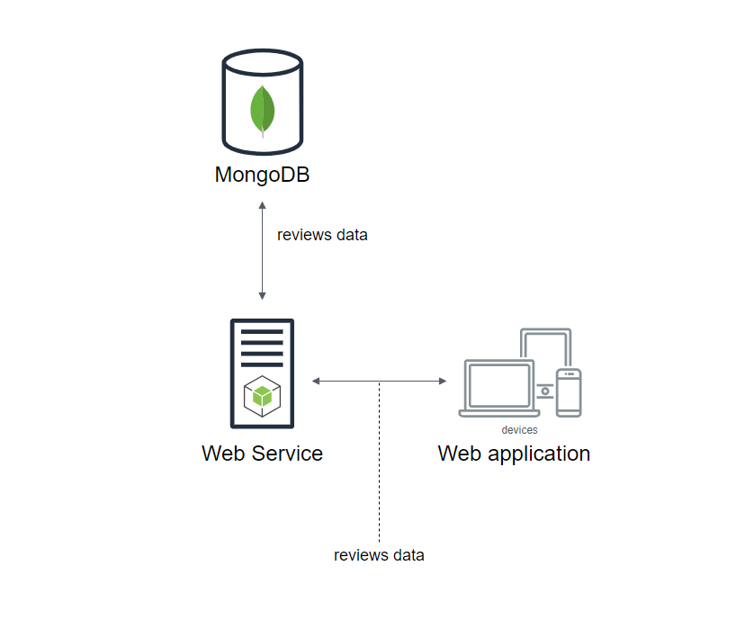

# Architecture Diagram

## Backend
* Node js and Express framework
* Jest as a testing tool (You can run test by using "npm run test" command)
## Fronted
* javascript and React framework

## API specification
Header | Value
-------|------
Content-Type| application/json

Resource            | GET             | PUT                | Response Type
--------------------|-----------------|--------------------|--------------
reviews/:id         | get review by id| update review by id| Object
reviews?query=:query| get reviews by a food keyword| -       | [Object]

## Format Response
`{ "reviewID": 1, "review": "example review" }`
